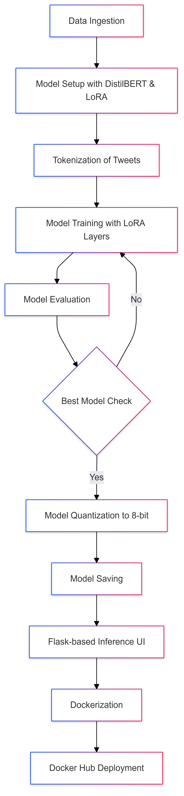

# Tweet-Auth-LoRADistil

## Introduction
Tweet-Auth-LoRADistil is a machine learning solution that identifies disaster-related tweets in real-time. This repository leverages a fine-tuned DistilBERT model, modified with LoRA (Low-Rank Adaptation) and optimized with 8-bit quantization for efficient use, even in constrained environments. With this setup, users can discern between disaster-related and non-disaster tweets, making it a valuable tool for emergency response, social media monitoring, and disaster tracking applications.

## Why Tweet-Auth-LoRADistil?
Tweet-Auth-LoRADistil offers a balance of speed, accuracy, and memory efficiency by fine-tuning a light language model (DistilBERT) specifically on disaster detection tweets and enhancing it with LoRA layers. By using Docker, this model is easily accessible and deployable across various platforms, enabling real-time insights with minimal setup.

## Any Special Notes or Points for Consideration
- **Model Quantization**: The model is quantized to 8-bit integers, which reduces its size but may affect accuracy marginally.
- **LoRA Usage**: LoRA layers are applied to key components of DistilBERT, allowing fine-tuning without large memory requirements.
- **Docker Deployment**: The project is available as a Docker image (`Tweet-Auth-LoRADistil`) on Docker Hub, ensuring compatibility and ease of deployment.

## Example Use Cases
- **Disaster Response**: Automatically classify incoming social media feeds to identify urgent disaster-related information.
- **Social Media Monitoring**: Filter for relevant tweets in disaster-prone areas to assess real-time situations.
- **Media and Journalism**: Track and verify incidents reported on social media to assist in news verification.

## About DistilBERT and LoRA
- **DistilBERT**: DistilBERT is a compact version of the BERT model, providing around 60% of the original BERT performance with just half its parameters. It’s suitable for tasks requiring both performance and efficiency.
- **LoRA**: LoRA (Low-Rank Adaptation) modifies large transformer models by introducing trainable rank-decomposed matrices in place of some of the weight matrices, making fine-tuning on specific tasks efficient and resource-friendly.

## Why Use DistilBERT?
DistilBERT is a smaller, faster version of BERT with comparable performance. It is ideal for situations that need high-quality text representations while minimizing memory usage and computational costs, such as real-time tweet analysis.

## Advantages
- **Efficient Memory Usage**: With LoRA and 8-bit quantization, the model is efficient on memory.
- **Real-Time Inference**: Flask-based UI allows for quick, user-friendly interaction.
- **Portable**: Available as a Docker image for simplified deployment.

## Disadvantages
- **Quantization Trade-offs**: 8-bit quantization may slightly reduce model accuracy.
- **Limited Context Understanding**: DistilBERT’s smaller size could mean it misses some context nuances compared to larger BERT-based models.

## Features
- **LoRA-enhanced DistilBERT**: Fine-tuned on disaster tweets dataset.
- **Flask UI**: User-friendly interface for tweet classification.
- **Dockerized**: Available as a Docker image for cross-platform compatibility.
- **Quantization**: Model quantized for reduced size and memory usage.

## Process Flowchart
Here’s the flowchart showing the overall structure of the process, from data ingestion to Docker deployment.



## Usage (Using Docker)
To get started with Tweet-Auth-LoRADistil using Docker, follow these steps:

1. **Pull the Docker Image**:
   ```bash
   docker pull munjpatel2003/tweet-auth-lora-distil:latest
   ```

2. **Run the Docker Container**:
   ```bash
   docker run -p 7860:7860 munjpatel2003/tweet-auth-lora-distil:latest
   ```
3. **Access the Web Interface**: Open your web browser and navigate to http://localhost:5000 to start analyzing tweets.

## Performance Optimization

- **LoRA Layers**: Only fine-tuned layers use LoRA, reducing memory overhead and speeding up training.
- **Dynamic Quantization**: Compressing the model to 8-bit integer weights reduces memory usage with minimal performance drop.
- **DistilBERT Base**: Chosen for its balance between processing efficiency and quality in NLP tasks.

## License

This project is licensed under the MIT License - see the [LICENSE](LICENSE) file for details.
